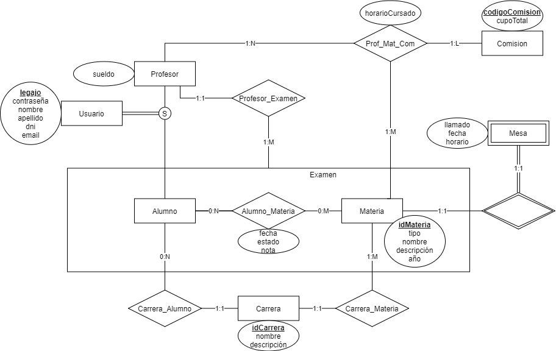

# TP Java

**Sistema de Autogestión de Alumnos UTN (sysacad)** \

José Socolsky - 48128 \
Gonzalo Serra - 47064

Repositorio de GitHub: https://github.com/tonchiserra/sysacad-java

### Checklist Regularidad:
| Requerimiento  | Cant. min. | Detalle / Listado de casos incluídos |
| -------------  | ---------- | ------------------------------------ |
| ABMC Simple    | 1 x integ  | Carrera y comisión                   |
|ABMC Dependiente| 1          | Materia                              |
| CU NO-ABMC     | 1          | CUU - Inscribirse                    |
| Listado simple | 1          | Materias para inscripción o estado académico|

### Checklist Aprobación Directa:
| Requerimiento  | Cant. min. | Detalle / Listado de casos incluídos |
| -------------  | ---------- | ------------------------------------ |
| ABMC           | todos      | Materia, Alumno, Profesor, Exámen, Carrera|
| CU "Complejo" nivel resumen | 1 | CURS - Rendir Exámen             |
| Listado complejo | 1        | Materias del plan con filtros        |
| Nivel de acceso | 2         | Usuario, Administrador               |
| Manejo de errores | Obligatorio |                                  |
| Publicar el sitio | Obligatorio |                                  |

### Modelo de Datos (Diagrama Entidad-Relación):

